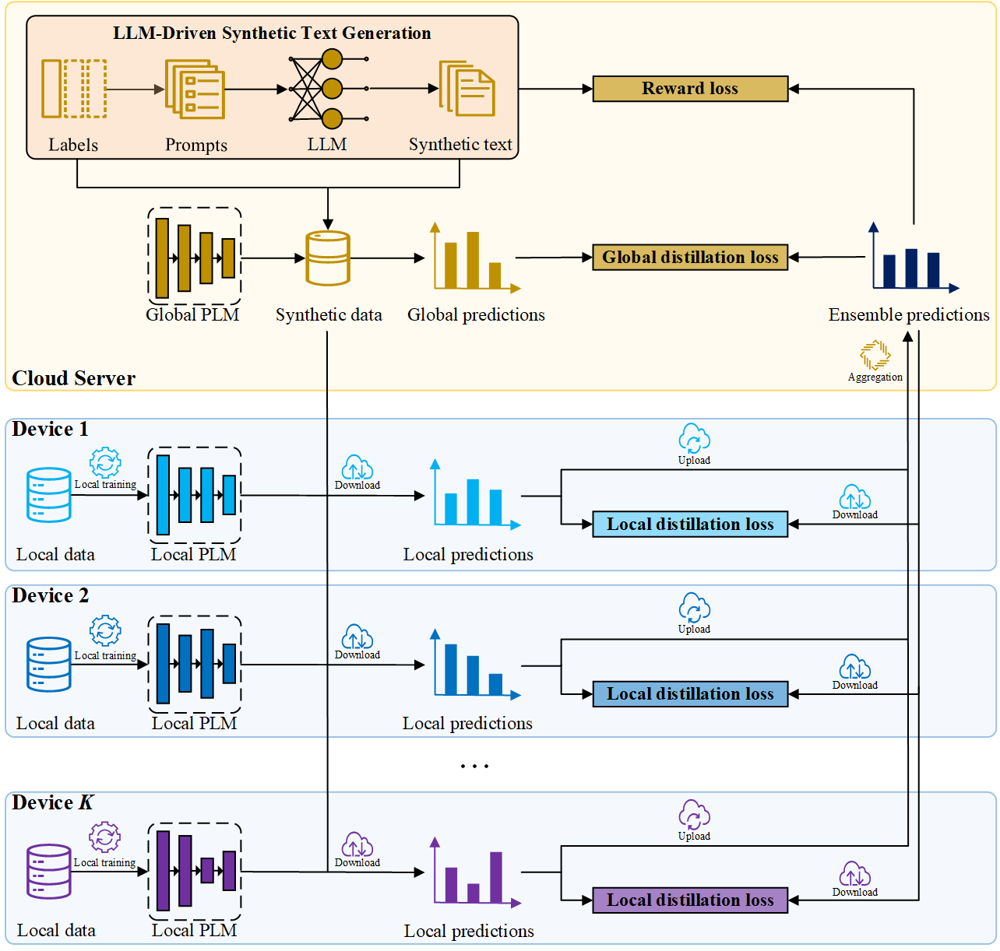

This repository contains an implementation with PyTorch for the paper "**LLM-Driven Synthetic Text Generation for Privacy-Preserving Federated Learning**". The figure below illustrates an overview of the FedSTG framework.



For more details about the technical details of FedSTG, please refer to our paper.

**Installation**

Run command below to install the environment (using python3):

```
pip install -r requirements.txt
```

**Usage**

Run command below to run experiments on homogeneous FL senarios:

```
# SST-2
python main.py \
  --algorithm FedSTG
  --dataset sst2 \
  --partition dirichlet \
  --alpha 100 \  # 100, 1
  --global_model bert-base-uncased \
  --local_models bert-base-uncased \
  --generator Llama-3.1-8B-Instruct \
  --max_seq_length 128 \
  --batch_size 16 \
  --K 10 \
  --C 1 \
  --T 10 \
  --E_k 3 \
  --lr_k 2e-5 \
  --lr 2e-5 \
  --lr_g 3e-6 \
  --N_syn 25000 \
  --max_new_tokens 100 \
  --do_sample True \
  --top_k 50 \
  --top_p 0.9 \
  --temperature 0.8 \
  --no_repeat_ngram_size 3 \
  --num_return_sentences 1 \
  --output_dir ./runs
  
# QQP
python main.py \
  --algorithm FedSTG
  --dataset qqp \
  --partition dirichlet \
  --alpha 100 \  # 100, 1
  --global_model bert-base-uncased \
  --local_models bert-base-uncased \
  --generator Llama-3.1-8B-Instruct \
  --max_seq_length 128 \
  --batch_size 16 \
  --K 10 \
  --C 1 \
  --T 10 \
  --E_k 3 \
  --lr_k 2e-5 \
  --lr 2e-5 \
  --lr_g 3e-6 \
  --N_syn 49401 \
  --max_new_tokens 100 \
  --do_sample True \
  --top_k 50 \
  --top_p 0.9 \
  --temperature 0.8 \
  --no_repeat_ngram_size 3 \
  --num_return_sentences 1 \
  --output_dir ./runs
  
# MNLI
python main.py \
  --algorithm FedSTG
  --dataset mnli \
  --partition dirichlet \
  --alpha 100 \  # 100, 1
  --global_model bert-base-uncased \
  --local_models bert-base-uncased \
  --generator Llama-3.1-8B-Instruct \
  --max_seq_length 128 \
  --batch_size 16 \
  --K 10 \
  --C 1 \
  --T 10 \
  --E_k 3 \
  --lr_k 2e-5 \
  --lr 2e-5 \
  --lr_g 3e-6 \
  --N_syn 550152 \
  --max_new_tokens 100 \
  --do_sample True \
  --top_k 50 \
  --top_p 0.9 \
  --temperature 0.8 \
  --no_repeat_ngram_size 3 \
  --num_return_sentences 1 \
  --output_dir ./runs
```

Run command below to run experiments on heterogeneous FL scenarios :

```
# SST-2
python main.py \
  --algorithm FedSTG
  --dataset sst2 \
  --partition dirichlet \
  --alpha 100 \  # 100, 1
  --global_model bert-base-uncased \
  --local_models bert-base-uncased,bert-base-uncased,bert-base-uncased,bert-base-uncased,bert-base-uncased,distilbert-base-uncased,distilbert-base-uncased,distilbert-base-uncased,distilbert-base-uncased,distilbert-base-uncased \
  --generator Llama-3.1-8B-Instruct \
  --max_seq_length 128 \
  --batch_size 16 \
  --K 10 \
  --C 1 \
  --T 10 \
  --E_k 3 \
  --lr_k 2e-5 \
  --lr 2e-5 \
  --lr_g 3e-6 \
  --N_syn 25000 \
  --max_new_tokens 100 \
  --do_sample True \
  --top_k 50 \
  --top_p 0.9 \
  --temperature 0.8 \
  --no_repeat_ngram_size 3 \
  --num_return_sentences 1 \
  --output_dir ./runs
  
# QQP
python main.py \
  --algorithm FedSTG
  --dataset qqp \
  --partition dirichlet \
  --alpha 100 \  # 100, 1
  --global_model bert-base-uncased \
  --local_models bert-base-uncased,bert-base-uncased,bert-base-uncased,bert-base-uncased,bert-base-uncased,distilbert-base-uncased,distilbert-base-uncased,distilbert-base-uncased,distilbert-base-uncased,distilbert-base-uncased \
  --generator Llama-3.1-8B-Instruct \
  --max_seq_length 128 \
  --batch_size 16 \
  --K 10 \
  --C 1 \
  --T 10 \
  --E_k 3 \
  --lr_k 2e-5 \
  --lr 2e-5 \
  --lr_g 3e-6 \
  --N_syn 49401 \
  --max_new_tokens 100 \
  --do_sample True \
  --top_k 50 \
  --top_p 0.9 \
  --temperature 0.8 \
  --no_repeat_ngram_size 3 \
  --num_return_sentences 1 \
  --output_dir ./runs
  
# MNLI
python main.py \
  --algorithm FedSTG
  --dataset mnli \
  --partition dirichlet \
  --alpha 100 \  # 100, 1
  --global_model bert-base-uncased \
  --local_models bert-base-uncased,bert-base-uncased,bert-base-uncased,bert-base-uncased,bert-base-uncased,distilbert-base-uncased,distilbert-base-uncased,distilbert-base-uncased,distilbert-base-uncased,distilbert-base-uncased \
  --generator Llama-3.1-8B-Instruct \
  --max_seq_length 128 \
  --batch_size 16 \
  --K 10 \
  --C 1 \
  --T 10 \
  --E_k 3 \
  --lr_k 2e-5 \
  --lr 2e-5 \
  --lr_g 3e-6 \
  --N_syn 550152 \
  --max_new_tokens 100 \
  --do_sample True \
  --top_k 50 \
  --top_p 0.9 \
  --temperature 0.8 \
  --no_repeat_ngram_size 3 \
  --num_return_sentences 1 \
  --output_dir ./runs
```

